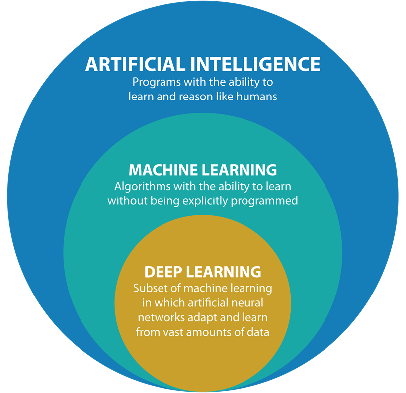

!!! note "Consulta"
    O conteúdo de introdução e das ferramentas pode, e deve, servir como fonte de consulta futura. É pra isso que serve o material!

# Aula 0 - Introdução aos Fundamentos de IA

Antes de escrever código, vale alinhar o vocabulário. Esta página existe para situar **o que é IA**, onde **Machine Learning** entra nesse campo e como chegamos no **Deep Learning**

- **Vídeos 1 a 8 do GOAT 🐐🐐🐐**: [youtube/playlist](https://www.youtube.com/watch?v=vStJoetOxJg&list=PLkDaE6sCZn6FNC6YRfRQc_FbeQrF8BwGI&index=1)
- **Introdução do curso de AI do Google**: [youtube/video](https://www.youtube.com/watch?v=Yq0QkCxoTHM)

---

## O que chamamos de IA?

Inteligência Artificial é o campo que estuda sistemas capazes de executar tarefas que, quando feitas por humanos, parecem exigir inteligência: perceber, reconhecer padrões, tomar decisões, gerar texto, traduzir, recomendar, planejar ou controlar ações.

O ponto importante é que **IA não é uma técnica única**. É um guarda-chuva que reúne várias abordagens diferentes para construir sistemas inteligentes.

!!! tip "IA é um campo, não um produto"
    Chatbots, carros autônomos, filtros de spam, sistemas de recomendação e reconhecimento facial são aplicações diferentes. O que elas compartilham é o uso de técnicas de IA para resolver problemas complexos.

---

## IA não é só aprendizado

Ao longo da história, a IA foi construída com ideias bem diferentes entre si. Alguns exemplos:

- **Sistemas baseados em regras**: o comportamento é definido explicitamente por regras escritas por humanos.
- **Busca e planejamento**: o sistema testa possibilidades e escolhe ações para atingir um objetivo.
- **Métodos probabilísticos**: o sistema lida com incerteza e toma decisões com base em probabilidades.
- **Machine Learning**: o sistema ajusta seu comportamento a partir de dados.

Isso importa porque ajuda a evitar uma confusão comum: **nem toda IA é Machine Learning**, e nem todo problema de IA precisa ser resolvido da mesma forma.

!!! note "Mudança de perspectiva"
    Em programação tradicional, você descreve as regras da solução. Em aprendizado de máquina, você descreve o problema e usa dados para que o sistema aprenda regularidades por conta própria.

---

## IA, Machine Learning e Deep Learning

A relação entre esses termos é hierárquica:

- **IA** é o campo amplo.
- **Machine Learning** é uma subárea da IA focada em aprender padrões a partir de dados.
- **Deep Learning** é uma subárea do Machine Learning baseada em **redes neurais com múltiplas camadas**.

Em outras palavras:

$$
\text{Deep Learning} \subset \text{Machine Learning} \subset \text{IA}
$$

O avanço recente da IA veio principalmente do Deep Learning. Visão computacional moderna, modelos de linguagem, geração de imagem, reconhecimento de fala e boa parte da IA generativa atual dependem diretamente dessa abordagem.

!!! warning "Ponto central"
    Na Insper AI, o foco é **Deep Learning**. Machine Learning clássico aparece como contexto e base conceitual, mas o eixo principal será entender redes neurais, treinamento, representações e aplicações modernas.

---

## Por que Deep Learning virou o centro?

Deep Learning ganhou protagonismo porque conseguiu escalar muito bem em três frentes ao mesmo tempo:

- **Dados em grande volume**
- **Poder computacional com GPUs**
- **Arquiteturas capazes de aprender representações complexas**

Em vez de depender tanto de features manuais desenhadas por especialistas, redes neurais profundas conseguem aprender representações úteis diretamente dos dados.

Exemplos:

- Em visão, a rede aprende bordas, texturas, formas e objetos.
- Em linguagem, a rede aprende relações entre palavras, contexto e estrutura semântica.
- Em áudio, a rede aprende padrões temporais e frequências relevantes.

!!! tip "Intuição importante"
    Deep Learning não é mágico. Ele funciona bem quando há dados, capacidade computacional e uma arquitetura adequada para o tipo de problema.

---

## Em resumo

Ao final desta introdução, a ideia não é dominar técnicas, mas sair com um mapa mental claro:

1. **IA é um campo amplo**, com várias abordagens.
2. **Machine Learning é apenas uma parte da IA**.
3. **Deep Learning é a parte do ML que mais vamos trabalhar**.

---

!!! Author
    **Gabriel Aguiar**