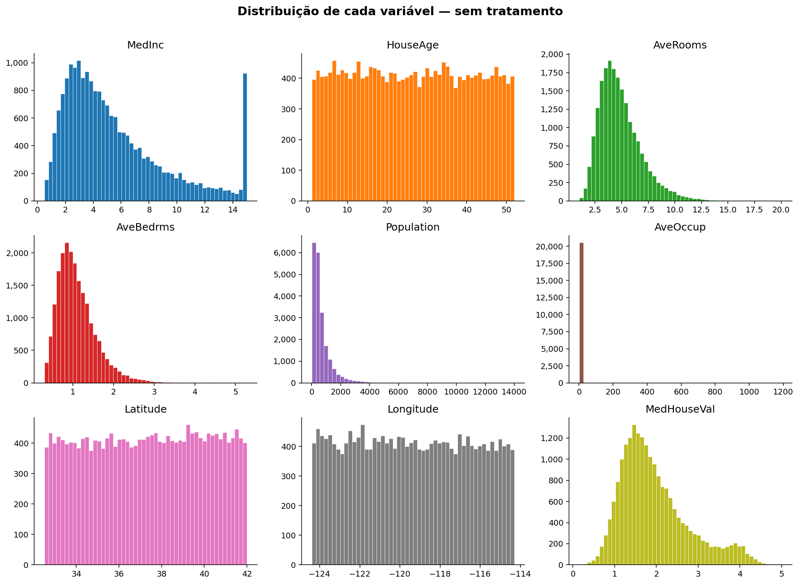
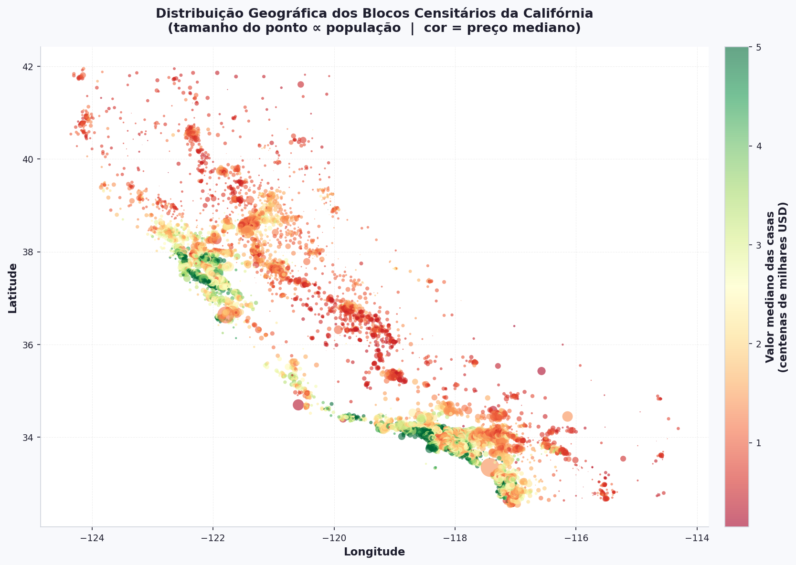

# Exploração dos Dados

Antes de aplicar qualquer modelo, precisamos **conhecer nossos dados**.  
Nesta seção vamos carregar o dataset, inspecionar sua estrutura e visualizar distribuições e relações entre variáveis sem nenhum pré-processamento por enquanto.

!!! tip "Por que explorar antes de modelar?"
    Modelos aprendem padrões dos dados. Se os dados tiverem problemas que você não conhece, o modelo vai aprender esses problemas também — e você não vai saber por quê ele errou.

---

## Carregamento e Inspeção Inicial

```python
import pandas as pd
import numpy as np
import matplotlib.pyplot as plt
import matplotlib.ticker as mticker
import seaborn as sns
from sklearn.datasets import fetch_california_housing

california = fetch_california_housing(as_frame=True)
df = california.frame

print("Shape:", df.shape)
df.head()
```

Após carregar, usamos `.describe()` para ver as estatísticas básicas de cada coluna:

```python
df.describe().T.round(2)
```

Saída esperada:

```text
               count     mean      std     min     25%      50%      75%       max
MedInc       20640.0     3.87     1.90    0.50    2.56     3.53     4.74     15.00
HouseAge     20640.0    28.64    12.59    1.00   18.00    29.00    37.00     52.00
AveRooms     20640.0     5.43     2.47    0.85    4.44     5.23     6.05    141.91
AveBedrms    20640.0     1.10     0.47    0.33    1.01     1.05     1.10     34.07
Population   20640.0  1425.48  1132.46    3.00  787.00  1166.00  1725.00  35682.00
AveOccup     20640.0     3.07    10.39    0.69    2.43     2.82     3.28   1243.33
Latitude     20640.0    35.63     2.14   32.54   33.93    34.26    37.71     41.95
Longitude    20640.0  -119.57     2.00 -124.35 -121.80  -118.49  -118.01   -114.31
MedHouseVal  20640.0     2.07     1.15    0.15    1.20     1.80     2.65      5.00
```

!!! note "O que observar no `.describe()`"
    - **mean vs 50%**: se a média e a mediana forem muito diferentes, a distribuição é assimétrica.
    - **max muito longe do 75%**: sinal claro de outliers.
    - **std alto**: grande dispersão nos dados.

---

## Distribuição das Variáveis

O histograma de cada variável nos mostra a forma da distribuição, a amplitude dos valores e possíveis anomalias.

```python
fig, axes = plt.subplots(3, 3, figsize=(14, 10))
axes = axes.flatten()
colors = plt.cm.tab10.colors

for i, col in enumerate(df.columns):
    axes[i].hist(df[col], bins=50, color=colors[i], edgecolor="white", linewidth=0.4)
    axes[i].set_title(col)
    axes[i].yaxis.set_major_formatter(
        mticker.FuncFormatter(lambda x, _: f"{int(x):,}")
    )

fig.suptitle("Distribuição de cada variável — sem tratamento",
             fontsize=15, fontweight="bold", y=1.01)
plt.tight_layout()
plt.show()
```



!!! warning "Algo já chama atenção"
    Repare no histograma de `MedHouseVal` (o target): há um pico artificial no valor **5.0**.  
    Isso indica que o dataset **truncou os preços acima de USD 500.000**. Vamos explorar isso na próxima seção.

---

## Distribuição Geográfica

O dataset contém latitude e longitude de cada bloco. Podemos plotar um mapa aproximado da Califórnia e colorir os pontos pelo preço mediano:

```python
fig, ax = plt.subplots(figsize=(10, 7))

sc = ax.scatter(
    df["Longitude"], df["Latitude"],
    c=df["MedHouseVal"],
    cmap="plasma",
    alpha=0.3,
    s=df["Population"] / 200,  # tamanho ∝ população
    linewidths=0,
)

cbar = plt.colorbar(sc, ax=ax)
cbar.set_label("Valor mediano das casas (100k USD)", fontsize=10)

ax.set_title("Localização dos blocos censitários\n"
             "(tamanho ∝ população  |  cor = preço)",
             fontsize=13, fontweight="bold")
ax.set_xlabel("Longitude")
ax.set_ylabel("Latitude")
plt.tight_layout()
plt.show()
```


