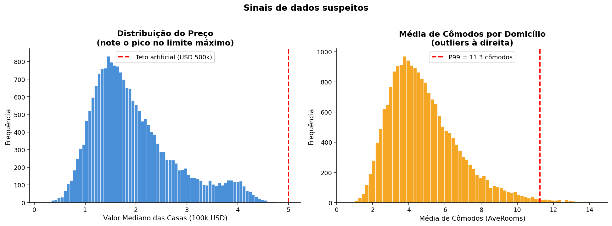
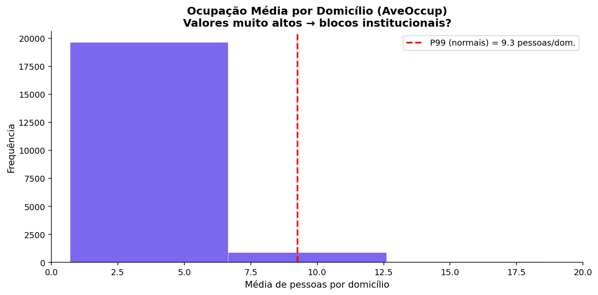
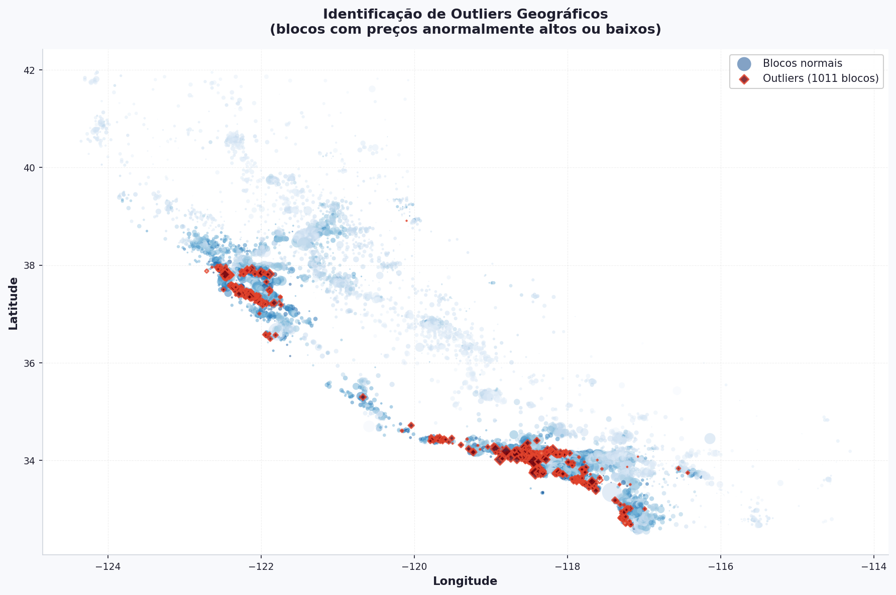

# ⚠️ Outliers e Dados Suspeitos

Os gráficos da exploração já deixaram pistas. Agora vamos investigar formalmente os pontos que podem **prejudicar o treinamento do modelo**.

!!! danger "Por que isso importa?"
    Um modelo de regressão linear minimiza o erro quadrático. Outliers têm erros grandes, e ao elevar ao quadrado, eles dominam a função de custo. O modelo acaba "distorcendo" os coeficientes para tentar acomodar esses pontos anômalos.

---

## Problema 1 — Teto Artificial no Preço

O valor máximo de `MedHouseVal` é exatamente **5.0** (USD 500.000). Isso não é coincidência: o dataset original truncou todos os preços acima desse valor.
```python
fig, axes = plt.subplots(1, 2, figsize=(14, 5))

# ── Gráfico 1: distribuição do preço ──────────────────────────────────────────
ax = axes[0]

ax.hist(df["MedHouseVal"], bins=80, color="#4a90d9",
        edgecolor="white", linewidth=0.4)

# Marca o teto artificial — todos os preços acima de 500k foram truncados aqui
ax.axvline(5.0, color="red", linestyle="--", linewidth=2,
           label="Teto artificial (USD 500k)")

ax.set_title("Distribuição do Preço\n(note o pico no limite máximo)",
             fontweight="bold")
ax.set_xlabel("Valor Mediano das Casas (100k USD)")
ax.set_ylabel("Frequência")
ax.legend()

# ── Gráfico 2: média de cômodos por domicílio ──────────────────────────────────
ax = axes[1]

ax.hist(df["AveRooms"], bins=100, color="#f5a623",
        edgecolor="white", linewidth=0.4)

# P99 = valor abaixo do qual estão 99% dos dados
# Tudo acima disso é candidato a outlier
p99 = df["AveRooms"].quantile(0.99)
ax.axvline(p99, color="red", linestyle="--", linewidth=2,
           label=f"P99 = {p99:.1f} cômodos")

ax.set_title("Média de Cômodos por Domicílio\n(outliers à direita)",
             fontweight="bold")
ax.set_xlabel("Média de Cômodos (AveRooms)")
ax.set_ylabel("Frequência")
ax.set_xlim(0, 15)  # limita o eixo para focar na região relevante
ax.legend()

plt.suptitle("Sinais de dados suspeitos",
             fontsize=14, fontweight="bold", y=1.02)
plt.tight_layout()
plt.show()
```



!!! warning "Consequência para o modelo"
    Todos os blocos com preço real acima de USD 500k aparecem como se valessem exatamente USD 500k. O modelo vai aprender que "casas muito boas custam USD 500k" — quando na verdade ele simplesmente não sabe o preço real delas.

---

## Problema 2 — Ocupação Anômala (Prisões, Hotéis, Hospitais)

`AveOccup` mede a **média de pessoas por domicílio** no bloco. Uma residência típica tem 2–4 moradores. Mas alguns blocos têm valores absurdos:
```python
fig, ax = plt.subplots(figsize=(10, 5))

ax.hist(df["AveOccup"], bins=200, color="#7b68ee",
        edgecolor="white", linewidth=0.3)

# Calcula o P99 apenas nos blocos "normais" (AveOccup <= 20)
# Se incluíssemos os extremos, o P99 seria distorcido pelos próprios outliers
p99 = df[df["AveOccup"] <= 20]["AveOccup"].quantile(0.99)
ax.axvline(p99, color="red", linestyle="--", linewidth=2,
           label=f"P99 (normais) = {p99:.1f} pessoas/dom.")

# Limita o eixo em 20 — os outliers extremos (500+) esticariam o gráfico
# e tornariam a distribuição principal ilegível
ax.set_xlim(0, 20)

ax.set_title("Ocupação Média por Domicílio (AveOccup)\n"
             "Valores muito altos → blocos institucionais?",
             fontweight="bold")
ax.set_xlabel("Média de pessoas por domicílio")
ax.set_ylabel("Frequência")
ax.legend()
plt.tight_layout()
plt.show()

# Lista os blocos com ocupação acima de 20 — os candidatos a institucionais
suspeitos = df[df["AveOccup"] > 20].sort_values("AveOccup", ascending=False)
print(f"Blocos com AveOccup > 20: {len(suspeitos)}")

# Exibe as colunas mais relevantes para investigar cada bloco suspeito
suspeitos[["Latitude", "Longitude", "AveOccup",
           "AveRooms", "Population", "MedHouseVal"]].head(10)
```



!!! example "Exemplos reais de blocos suspeitos"
    | Tipo | AveOccup esperado | Por quê distorce? |
    |---|---|---|
    | **Presídio** | 500–1.000+ | Centenas de presos num "domicílio" |
    | **Hotel** | 100–500 | Quartos de hotel contam como domicílios |
    | **Hospital / Asilo** | 50–200 | Leitos por "unidade residencial" |
    | **Base militar** | 200–800 | Quartel conta como domicílio |

---

## Problema 3 — Outliers Geográficos

Nem todos os outliers são numéricos. Alguns blocos têm preços **anormalmente altos ou baixos** comparados com seus vizinhos geográficos:
```python
from scipy import stats

# Z-score mede quantos desvios padrão um valor está da média
# |z| > 2.5 significa que o ponto está bem fora do padrão da distribuição
z_scores = np.abs(stats.zscore(df["MedHouseVal"]))
eh_suspeito = z_scores > 2.5

fig, ax = plt.subplots(figsize=(12, 8))

# ── Blocos normais: coloridos pelo preço em azul ───────────────────────────────
normais = df[~eh_suspeito]  # ~ inverte o booleano — seleciona os NÃO suspeitos
ax.scatter(normais["Longitude"], normais["Latitude"],
           c=normais["MedHouseVal"], cmap="Blues",
           alpha=0.5,
           s=normais["Population"]/100,  # tamanho proporcional à população
           linewidths=0,
           label="Blocos normais")

# ── Blocos suspeitos: destacados em vermelho com borda ────────────────────────
suspeitos = df[eh_suspeito]
ax.scatter(suspeitos["Longitude"], suspeitos["Latitude"],
           c=suspeitos["MedHouseVal"], cmap="Reds",
           alpha=0.8,
           s=suspeitos["Population"]/100,
           linewidths=1.5, edgecolors="red",
           marker="D",  # losango para diferenciar visualmente dos normais
           label=f"Outliers ({len(suspeitos)} blocos)")

ax.set_title("Outliers Geográficos: Blocos com Preços Anômalos",
             fontweight="bold", fontsize=12)
ax.set_xlabel("Longitude")
ax.set_ylabel("Latitude")
ax.legend()
ax.grid(True, alpha=0.2)
plt.tight_layout()
plt.show()
```



!!! warning "O que causa outliers geográficos?"
    - **Bairros premium inesperados** — Uma região normalmente barata tem um bloco muito caro (gentrificação, novo desenvolvimento)
    - **Guetos isolados** — Um bairro nobre tem um bloco muito barato (bairro degradado, insegurança)
    - **Efeitos de fronteira** — Blocos na borda de cidades/regiões têm padrões de preço muito diferentes
    - **Erros de geocodificação** — Coordenadas incorretas podem colocar um bloco no lugar errado do mapa