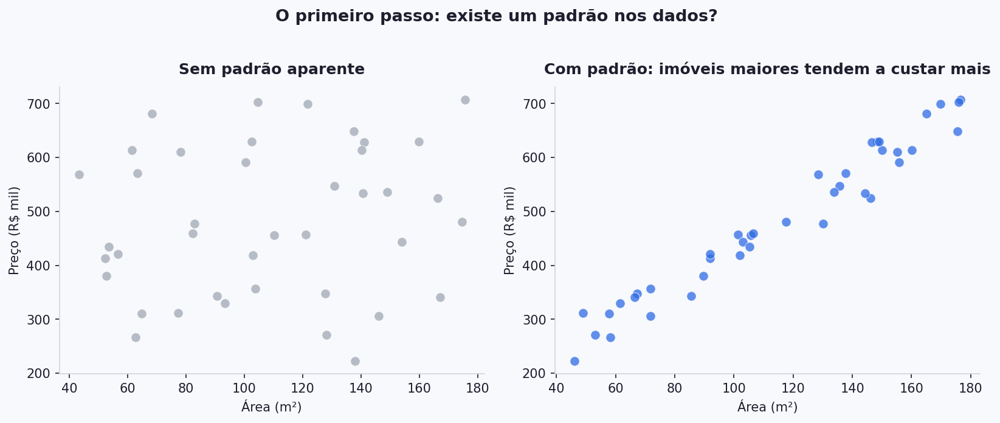
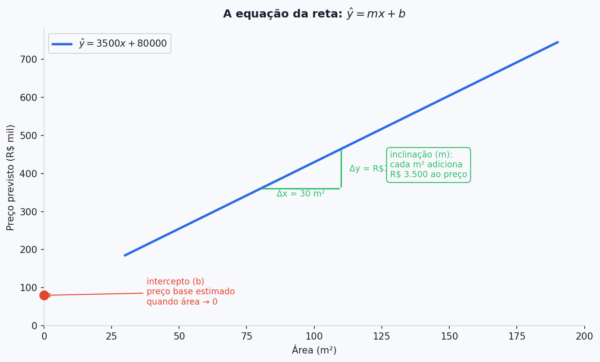
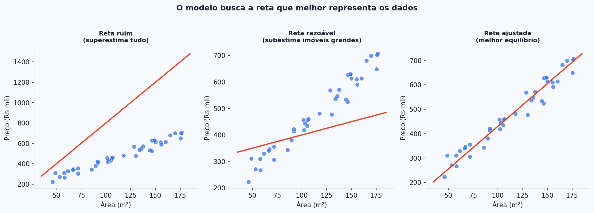
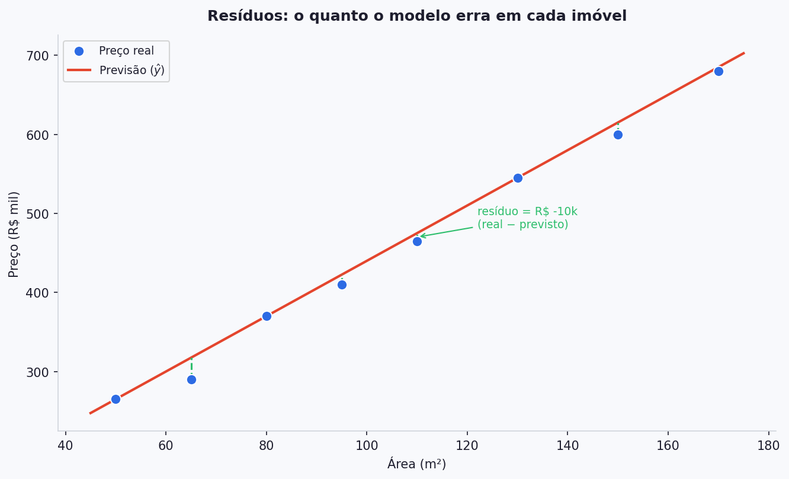
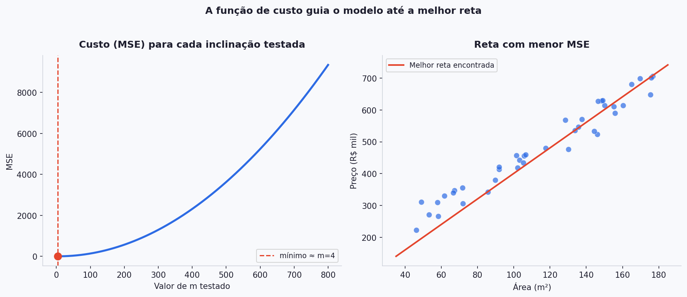
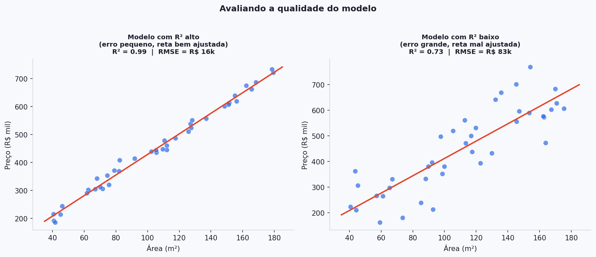

# 📈 Regressão Linear — Teoria

Regressão linear é o ponto de entrada para machine learning supervisionado. É um modelo simples o suficiente para entender completamente — e rico o suficiente para revelar como todos os outros modelos funcionam.

Para tornar os conceitos concretos, vamos usar o mesmo exemplo do início ao fim: **prever o preço de um imóvel a partir da sua área em m²**.

---

## A ideia central

Imagine que você tem os dados de 40 imóveis vendidos na sua cidade — área e preço de cada um. Você joga isso num gráfico.

O gráfico da direita mostra um padrão claro: imóveis maiores tendem a custar mais. Regressão linear é a técnica que **encontra e representa esse padrão como uma reta**.

Essa reta é o modelo. Quando chegar um imóvel novo com 90 m², o modelo olha para a reta e diz: *"com base nos dados que já vi, o preço esperado é esse."*

---

## A equação da reta

Você provavelmente já viu essa equação antes:

$$
\hat{y} = mx + b
$$

No nosso exemplo de imóveis:

| Símbolo   | Nome                | No exemplo                           |
| --------- | ------------------- | ------------------------------------ |
| $x$       | variável de entrada | área do imóvel (m²)                  |
| $\hat{y}$ | valor previsto      | preço estimado (R\$)                 |
| $m$       | inclinação          | quanto o preço sobe a cada m² a mais |
| $b$       | intercepto          | valor base quando área tende a zero  |

No gráfico, vemos que cada m² adicional acrescenta aproximadamente R\$ 3.500 ao preço — esse é o $m$. O intercepto $b$ (R\$ 80.000) é onde a reta cruza o eixo vertical.

!!! note "Em ML você vai ver outras notações"
    A mesma equação aparece na literatura como $\hat{y} = \theta_1 x + \theta_0$ ou $\hat{y} = w_1 x + w_0$. Os símbolos mudam, o conceito é idêntico. $m$ e $b$ são os **parâmetros** que o modelo aprende durante o treinamento.

---

## O que "ajustar" uma reta significa

Dado um conjunto de pontos, existem infinitas retas possíveis. O trabalho do modelo é encontrar **a reta que melhor representa os dados** — ou seja, a que erra menos no conjunto todo.

A reta da esquerda superestima todos os imóveis. A do meio melhora, mas ainda erra feio nos imóveis maiores. A da direita encontra o melhor equilíbrio. Mas como o modelo mede qual das três é "melhor"? É aqui que entra o conceito de resíduo.

---

## Resíduos

Para cada imóvel no conjunto de dados, o modelo faz uma previsão. A diferença entre o preço real e o preço previsto é chamada de **resíduo**:

$$
r_i = y_i - \hat{y}_i
$$

Se um imóvel custou R\$ 100.000 e o modelo previu R\$ 90.000, o resíduo é −R\$ 10k.

As linhas verticais verdes mostram o resíduo de cada imóvel — o quanto a reta está errando em cada ponto. O objetivo do treinamento é encontrar os valores de $m$ e $b$ que tornam esses erros os menores possíveis **no conjunto todo**.

---

## Função de Custo — MSE

Para comparar duas retas, precisamos de um número único que resuma todos os resíduos. É isso que a **função de custo** faz.

A mais usada em regressão linear é o **MSE** (*Mean Squared Error* — Erro Quadrático Médio):

$$
MSE = \frac{1}{n} \sum_{i=1}^{n} (y_i - \hat{y}_i)^2
$$

Em palavras: calcule o erro de cada imóvel, eleve ao quadrado, some tudo e divida pelo número de imóveis.

**Por que elevar ao quadrado?** Dois motivos:

* Um erro de −R\$ 50k e um erro de +R\$ 50k não devem se cancelar — ambos são igualmente ruins
* Erros maiores são penalizados de forma mais intensa: um erro de R\$ 100k pesa 4× mais que um erro de R\$ 50k

!!! tip "MSE como bússola"
    O modelo não sabe qual reta é a melhor de antemão. Ele testa diferentes valores de $m$ e $b$, calcula o MSE para cada combinação e caminha na direção que reduz esse número. Quando o MSE para de cair, o treinamento terminou.

O gráfico da esquerda mostra o MSE para diferentes valores de $m$ — há um mínimo claro. O gráfico da direita é a reta correspondente a esse mínimo.

---

## Avaliando o modelo

Depois de treinar, como saber se o modelo é bom? Duas métricas são essenciais:

### R² — Coeficiente de Determinação

$$
R^2 = 1 - \frac{\sum(y_i - \hat{y}_i)^2}{\sum(y_i - \bar{y})^2}
$$

Vai de **0 a 1**. Interpretação direta: *"que fração da variação nos preços o modelo consegue explicar pela área?"*

* $R^2 = 0.92$ → 92% da variação de preços é explicada pela área. Modelo bem ajustado.
* $R^2 = 0.40$ → apenas 40% da variação é capturada. Há muito padrão que o modelo não está vendo.

### RMSE — Raiz do Erro Quadrático Médio

$$
RMSE = \sqrt{MSE} = \sqrt{\frac{1}{n}\sum_{i=1}^{n}(y_i - \hat{y}_i)^2}
$$

É o MSE transformado de volta para a **unidade original dos dados**. Se você está prevendo preços em reais, o RMSE também é em reais — direto de interpretar. Um RMSE de R\$ 35k significa que, em média, o modelo erra R\$ 35.000 por imóvel.

!!! warning "R² alto no treino não garante um bom modelo"
    Um modelo pode ter R² elevado nos dados de treinamento e falhar em dados novos — fenômeno chamado de *overfitting*. Avaliar o modelo em imóveis que ele **nunca viu** é parte essencial do processo. Você vai ver isso em detalhes nas próximas aulas.

---

## Resumo

| Conceito            | No exemplo dos imóveis                                     |
| ------------------- | ---------------------------------------------------------- |
| **Equação da reta** | Preço = 3500 × Área + 80.000                               |
| **Resíduo**         | Diferença entre o preço real e o previsto para cada imóvel |
| **MSE**             | Média dos erros ao quadrado em todo o conjunto             |
| **R²**              | Quanto da variação de preços a área consegue explicar      |
| **RMSE**            | Erro médio em reais — mesma unidade do problema            |

---

## 📚 Explore a Documentação

* **Scikit-learn — LinearRegression:** https://scikit-learn.org/stable/modules/generated/sklearn.linear_model.LinearRegression.html
* **Scikit-learn — métricas de regressão:** https://scikit-learn.org/stable/modules/model_evaluation.html#regression-metrics
* **StatQuest — Linear Regression (vídeo):** https://www.youtube.com/watch?v=nk2CQITm_eo