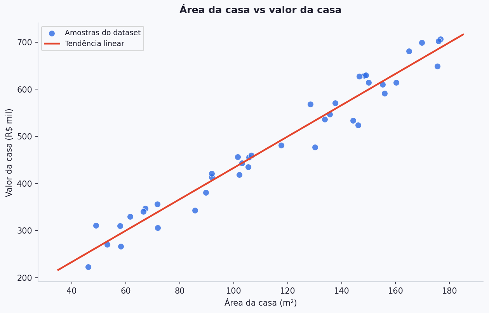

# Regressão Linear — Teoria

Regressão linear é um dos pontos de entrada mais importantes para machine learning supervisionado.  
Ela é simples o suficiente para ser entendida por completo e, ao mesmo tempo, rica o bastante para introduzir ideias que aparecem em modelos muito mais complexos.

Acompanhe essa teoria com os vídeos do curso de Machine Learning do Andrew Ng
> - [Machine Learning Specialization - vídeos 9 a 14](https://www.youtube.com/watch?v=dLc-lfEEYss&list=PLkDaE6sCZn6FNC6YRfRQc_FbeQrF8BwGI&index=9)

---

## A ideia central

O objetivo da regressão linear é modelar a relação entre variáveis de entrada e uma variável de saída **contínua**.

Se você plota, por exemplo, área de um imóvel no eixo horizontal e preço no eixo vertical, costuma aparecer uma tendência: imóveis maiores tendem a custar mais. A regressão linear tenta capturar esse padrão com uma reta.

A pergunta que guia tudo é:

**entre todas as retas possíveis, qual representa melhor os dados?**

---

## O Caso Simples: Uma Única Feature

Começando com o caso mais simples, imagine que queremos prever o valor de uma casa usando apenas uma única variável: a área.

No gráfico abaixo:

- o eixo `x` representa a área da casa
- o eixo `y` representa o valor da casa
- cada ponto representa uma amostra do dataset

Como os pontos seguem uma tendência crescente, faz sentido tentar resumir esse padrão com uma reta.

Essa reta não precisa passar exatamente por todos os pontos.  
Ela precisa capturar a **tendência geral** dos dados.

Na matemática, uma reta é escrita assim:

\[
y = ax + b
\]

Onde, *a* é o **coeficiente angular** e *b* é o coeficiente linear.

Na regressão linear, usamos a mesma ideia para fazer previsões:

\[
\hat{y} = wx + b
\]

| Símbolo | Leitura no exemplo |
|---|---|
| \(x\) | área da casa |
| \(\hat{y}\) | valor previsto da casa |
| \(w\) | inclinação da reta |
| \(b\) | ponto onde a reta cruza o eixo vertical |

- O coeficiente, ou peso (***weight***, se acostume com esse nome) \(w\) diz quanto a previsão muda quando a entrada aumenta 1 unidade.  
- O intercepto, ou viés (***bias***, se acostume com esse nome) \(b\) é o valor previsto quando \(x = 0\).

??? question "Pergunta: Considerando a definição acima, o que você entende por "treinar" o modelo?"
    Treinar o modelo é justamente encontrar os valores ideais de **weight** e **bias** para que a reta represente os dados da melhor forma possível.

No exemplo de imóveis, isso significa:

- \(w\) diz quanto o valor previsto sobe a cada metro quadrado adicional
- \(b\) funciona como um valor base da reta

Se, por exemplo, \(w = 3500\), isso significa que cada unidade adicional de área aumenta a previsão em cerca de `R$ 3.500`.

O ponto principal aqui é que, com uma única feature, a regressão linear é apenas uma forma de ajustar uma reta aos dados.

!!! note "Outras notações"
    Você também pode ver a mesma equação escrita como \(\hat{y} = mx + b\), \(\hat{y} = \theta_1 x + \theta_0\) ou \(\hat{y} = w_1 x + w_0\).  
    A ideia é a mesma.

---

## Generalizando para Múltiplas Features

Na prática, quase nunca temos apenas uma variável de entrada.  
Em vez de usar só uma feature, podemos usar várias ao mesmo tempo:

\[
\hat{y} = b + w_1 x_1 + w_2 x_2 + \dots + w_n x_n
\]

Agora cada feature tem um coeficiente (peso) próprio.

No caso do California Housing, por exemplo, o modelo pode usar ao mesmo tempo:

- renda mediana
- idade das casas
- número médio de cômodos
- população
- latitude e longitude

Cada peso passa a representar o efeito de uma feature **mantendo as demais fixas**.

---

## A Forma Vetorizada

Para simplificar a notação, agrupamos os coeficientes em um vetor \(\mathbf{w}\) e as features em um vetor \(\mathbf{x}\):

\[
\mathbf{w} =
\begin{pmatrix}
w_1 \\
w_2 \\
\vdots \\
w_n
\end{pmatrix}
\qquad
\mathbf{x} =
\begin{pmatrix}
x_1 \\
x_2 \\
\vdots \\
x_n
\end{pmatrix}
\]

A equação fica:

\[
\hat{y} = \mathbf{w}^T \mathbf{x} + b
\]

Essa expressão é um **produto escalar** entre o vetor de pesos e o vetor de features.

Quando fazemos isso para muitas amostras ao mesmo tempo, organizamos os dados em uma matriz \(X\):

\[
\hat{\mathbf{y}} = X\mathbf{w} + b
\]

Onde cada linha da matriz é uma amostra de dados e cada coluna é uma feature.

É assim que bibliotecas como o scikit-learn implementam regressão linear na prática.

!!! note "Por que isso importa?"
    Essa forma vetorial aparece em praticamente todo machine learning supervisionado.  
    Entender regressão linear nesse formato é essencial.

    Para entender melhor, assista os vídeos 21 a 23 do curso do Andrew:
    > - [Machine Learning Specialization - vídeos 21 a 23](https://www.youtube.com/watch?v=jXg0vU0y1ak&list=PLkDaE6sCZn6FNC6YRfRQc_FbeQrF8BwGI&index=21) 

---

## Resíduos

Sempre que o modelo faz uma previsão, podemos comparar o valor previsto com o valor real.

Essa diferença é o **resíduo**, o erro de uma amostra individual:

\[
r_i = y_i - \hat{y}_i
\]

Se o resíduo é positivo, o modelo subestimou.  
Se é negativo, o modelo superestimou.

O treino da regressão linear tenta encontrar os valores de \(w\) e \(b\) que tornam esses erros, no conjunto, o menor possível.

---

## Função de Custo — MSE

Para saber se uma reta está boa ou ruim, precisamos resumir todos os resíduos em um único número. 

Como os resíduos dependem das previsões, e as previsões dependem dos parâmetros do modelo (**\(w\)** e **\(b\)**), faz sentido afirmar que o resíduo acumulado do modelo (custo) é uma função dos parâmetros, certo? Por isso, esse cálculo se chama **Função de Custo**.

!!! note 
    Para entender melhor, assista os vídeos 11 e 12 do curso do Andrew:
    > - [Machine Learning Specialization - vídeos 11 e 12](https://www.youtube.com/watch?v=CFN5zHzEuGY&list=PLkDaE6sCZn6FNC6YRfRQc_FbeQrF8BwGI&index=11) 

A função de custo mais comum na regressão linear é o **MSE** (Mean Squared Error):

\[
MSE = \frac{1}{n} \sum_{i=1}^{n}(y_i - \hat{y}_i)^2
\]

Ela mede a média dos erros ao quadrado.

### Por que elevar ao quadrado?

- Para evitar que erros positivos e negativos se cancelem.
- Para penalizar mais fortemente erros grandes.

Por isso, treinar um modelo de regressão linear significa encontrar os parâmetros que **minimizam o MSE**.

??? question "Então, o que significa treinar o modelo na prática?"
    No fundo, treinar significa procurar os valores de \(w\) e \(b\) que minimizam a função de custo.

    Uma forma clássica de fazer isso é por meio de algoritmos de otimização, como o **Gradiente Descendente**:

    

    Nesta aula, não vamos implementar esse processo manualmente.  
    Quando usamos `LinearRegression` no scikit-learn, chamamos `.fit()` e a biblioteca resolve essa parte para nós.

    O ponto importante é: treinar significa **ajustar os parâmetros para reduzir o erro**.

---

## Avaliando o Modelo

Depois de treinar, precisamos medir quão bem o modelo se saiu.  
As métricas mais importantes nesta aula são `R²`, `RMSE` e `MAE`.

Cada uma responde a uma pergunta diferente:

| Métrica | Pergunta prática | O que ela destaca |
|---|---|---|
| `R²` | o modelo capturou o padrão geral dos dados? | explicação da variação do target |
| `MAE` | em média, o modelo erra por quanto? | tamanho do erro típico |
| `RMSE` | erros muito grandes estão pesando? | sensibilidade a erros extremos |

### R² — Coeficiente de Determinação

\[
R^2 = 1 - \frac{\sum(y_i - \hat{y}_i)^2}{\sum(y_i - \bar{y})^2}
\]

O `R²` mede quanto da variação do target o modelo consegue explicar.

!!! info "Intuição"
    O `R²` diz se o modelo está capturando o **padrão geral** dos dados ou se ainda está muito próximo de um palpite ingênuo, como prever sempre a média.

!!! warning "Problema isolado"
    O `R²` não diz **quanto** o modelo erra em termos concretos. Um modelo pode ter `R²` razoável e ainda cometer erros grandes.

| Valor de R² | Interpretação |
|---|---|
| próximo de 1 | o modelo explica bem os dados |
| próximo de 0 | o modelo pouco melhora em relação à média |
| menor que 0 | o modelo está pior do que prever a média |

### MAE — Erro Absoluto Médio

\[
MAE = \frac{1}{n}\sum|y_i - \hat{y}_i|
\]

O `MAE` mede, em média, o tamanho do erro do modelo na mesma unidade do problema.

!!! info "Intuição"
    O `MAE` responde: **em média, o modelo erra por quanto?**

    É uma métrica direta e fácil de interpretar, especialmente quando você quer uma noção simples do erro típico.

!!! warning "Problema isolado"
    O `MAE` trata todos os erros de forma linear, então pode esconder o impacto de poucos erros muito grandes.

### RMSE — Raiz do Erro Quadrático Médio

\[
RMSE = \sqrt{\frac{1}{n}\sum(y_i - \hat{y}_i)^2}
\]

O `RMSE` também mede erro médio, mas dá mais peso para erros muito grandes.

!!! info "Intuição"
    O `RMSE` responde: **o modelo está cometendo erros grandes com frequência ou intensidade?**

    Se o `RMSE` estiver muito acima do `MAE`, isso costuma ser sinal de que alguns erros extremos estão pesando bastante.

!!! warning "Problema isolado"
    O `RMSE` pode ser muito influenciado por outliers e dar a impressão de que o modelo é pior do que ele é no caso típico.

| | MAE | RMSE |
|---|---|---|
| Sensibilidade a outliers | menor | maior |
| Leitura prática | erro médio absoluto | erro médio com peso maior para erros grandes |

!!! warning "Leitura correta das métricas"
    Uma métrica isolada nunca conta a história inteira.  
    Sempre interprete `R²`, `RMSE` e `MAE` junto com o contexto dos dados e com os gráficos da análise.
