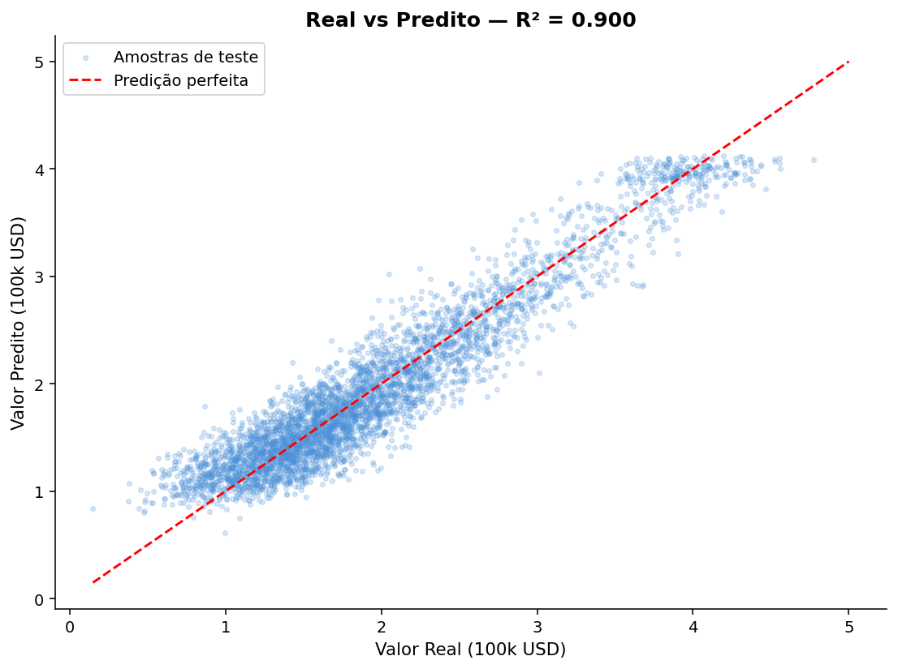

# 🤖 Treinando o Modelo

Com os dados explorados, vamos treinar nosso primeiro modelo de regressão linear.  
O fluxo será simples e direto: dividir os dados, treinar e avaliar.

---

## Separando Features e Target
```python
# Remove a coluna alvo do conjunto de features
# X contém tudo que o modelo vai usar para prever
X = df.drop(columns=["MedHouseVal"])

# y é o que queremos prever — o preço mediano de cada bloco
y = df["MedHouseVal"]
```

---

## Train / Test Split

Dividimos o dataset em duas partes:

- **Treino (80%)**: o modelo aprende os coeficientes a partir desses dados.
- **Teste (20%)**: dados que o modelo **nunca viu** — usados para medir a performance real.
```python
from sklearn.model_selection import train_test_split

X_train, X_test, y_train, y_test = train_test_split(
    X, y,
    test_size=0.2,   # 20% dos dados reservados para teste
    random_state=42  # garante que o split seja igual toda vez que rodar
)

print(f"Treino:  {X_train.shape[0]:,} amostras")
print(f"Teste:   {X_test.shape[0]:,} amostras")
```

!!! warning "Por que não usar tudo para treinar?"
    Se avaliássemos o modelo nos mesmos dados em que ele treinou, mediríamos apenas o quanto ele **memorizou** os dados — não o quanto ele **generalizou**. O conjunto de teste simula dados novos do mundo real.

---

## Treinamento com `LinearRegression`

O `LinearRegression` do scikit-learn resolve a **Equação Normal** internamente, encontrando os coeficientes que minimizam o erro quadrático médio de forma exata:

$$\hat{\theta} = (X^T X)^{-1} X^T y$$
```python
from sklearn.linear_model import LinearRegression

model = LinearRegression()

# .fit() é onde o aprendizado acontece — o modelo resolve a Equação Normal
# e armazena os coeficientes ótimos internamente
model.fit(X_train, y_train)

# model.intercept_ é o b₀ — o valor base quando todas as features são zero
print("Intercepto (b₀):", round(model.intercept_, 4))

# model.coef_ é o vetor w — um coeficiente para cada feature
# zip() emparelha cada nome de coluna com seu respectivo coeficiente
print("\nCoeficientes:")
for feat, coef in zip(X.columns, model.coef_):
    print(f"  {feat:15s}: {coef:+.4f}")
```

!!! note "Interpretando os coeficientes"
    Cada coeficiente indica: **mantendo todas as outras variáveis fixas**, quanto o preço previsto muda ao aumentar aquela feature em 1 unidade.  
    Por exemplo: um coeficiente positivo em `MedInc` significa que blocos com maior renda mediana tendem a ter casas mais caras — o que faz sentido!

---

## Avaliação com R²

O **R²** (coeficiente de determinação) mede a proporção da variância do target que o modelo consegue explicar:

$$R^2 = 1 - \frac{\sum (y_i - \hat{y}_i)^2}{\sum (y_i - \bar{y})^2}$$

| Valor de R² | Interpretação |
|---|---|
| **1.0** | Modelo perfeito |
| **0.0** | Equivalente a prever sempre a média |
| **< 0.0** | Pior do que prever a média |

```python
from sklearn.metrics import r2_score

# Gera previsões tanto no treino quanto no teste
# Comparar os dois R² é a forma mais direta de detectar overfitting
y_pred_train = model.predict(X_train)
y_pred_test  = model.predict(X_test)

r2_train = r2_score(y_train, y_pred_train)
r2_test  = r2_score(y_test,  y_pred_test)

print(f"R² Treino: {r2_train:.4f}")
print(f"R² Teste:  {r2_test:.4f}")
# Se r2_train >> r2_test, o modelo está sofrendo de overfitting
```

---

## Visualizando: Real vs Predito

O gráfico ideal seria uma linha diagonal perfeita. Qualquer desvio dessa linha é erro do modelo:
```python
fig, ax = plt.subplots(figsize=(8, 6))

# Cada ponto é uma amostra do conjunto de teste
# Eixo x = preço real, Eixo y = preço previsto pelo modelo
ax.scatter(y_test, y_pred_test,
           alpha=0.2,       # transparência para revelar densidade
           s=8,             # pontos pequenos — temos milhares de amostras
           color="#4a90d9",
           label="Amostras de teste")

# Linha de referência: previsão perfeita (real == previsto)
# Pontos acima da linha = modelo superestimou
# Pontos abaixo da linha = modelo subestimou
ax.plot([y.min(), y.max()], [y.min(), y.max()],
        color="red", linewidth=1.5, linestyle="--",
        label="Predição perfeita")

ax.set_xlabel("Valor Real (100k USD)")
ax.set_ylabel("Valor Predito (100k USD)")
ax.set_title(f"Real vs Predito — R² = {r2_test:.3f}", fontweight="bold")
ax.legend()
plt.tight_layout()
plt.show()
```



!!! warning "O que o gráfico revela"
    - A **faixa horizontal** no topo (valor real = 5.0) é o efeito do teto artificial de preço — o modelo tenta prever valores variados, mas o target real é sempre 5.0.
    - A dispersão dos pontos mostra que a relação entre as features e o preço **não é perfeitamente linear**.
