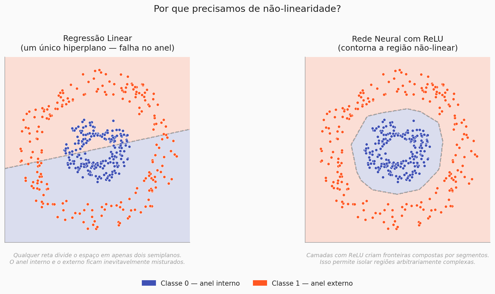
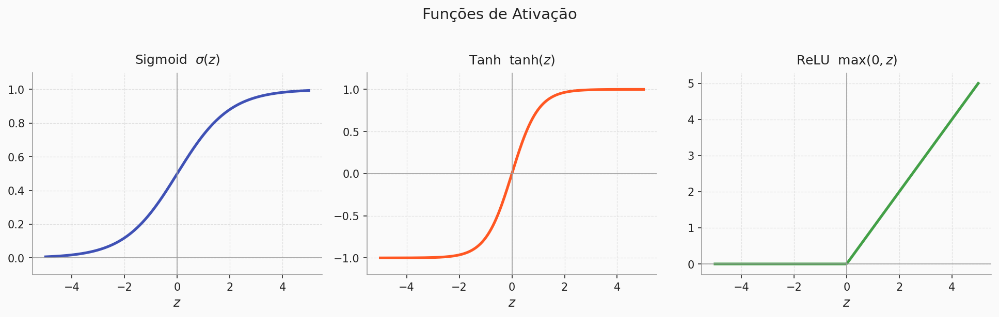

# Introdução às Redes Neurais

## O que é uma mosca?
Sério, o que é uma mosca?
??? question "Reflita antes de continuar"
    Antes de prosseguirmos, pense: **o que define uma mosca?**

    - É o seu corpo físico — asas, olhos compostos, patas?
    - São os seus comportamentos — voar, pousar, fugir de ameaças?
    - Ou é a forma como o seu sistema nervoso processa o mundo ao redor?

    Anote sua resposta. Voltaremos a ela em breve.

    Pode parecer uma pergunta sem sentido, mas logo mais veremos que a resposta tem bem mais a ver com o assunto do que parece.

---

## Replicando o cérebro de uma mosca

Em 2023, pesquisadores do Google e do Instituto Janelia mapearam **todo o conectoma** do cérebro de uma larva de *Drosophila melanogaster* (a mosca-das-frutas). Foram identificados **3.016 neurônios** e aproximadamente **548.000 sinapses**.

Mas o passo seguinte foi o que surpreendeu: esse mapeamento foi usado para **construir uma rede neural artificial** que reproduz a arquitetura biológica da mosca. Não uma simulação genérica: uma rede cujas conexões espelham, sinapse por sinapse, as conexões reais do animal.

Isso levanta uma questão fundamental:

!!! info "A pergunta central"
    Se replicarmos fielmente todas as conexões neurais de um ser vivo em software,
    estamos replicando apenas o seu *processamento de informação* — ou algo mais?

Nas próximas seções, vamos entender **como redes neurais artificiais funcionam**, por que a estrutura do cérebro de uma mosca serve como modelo, e o que isso nos diz sobre inteligência, aprendizado e representação do mundo.

---

## O neurônio biológico

Para entender redes neurais artificiais, precisamos primeiro olhar para o que elas imitam.

Um neurônio biológico é uma célula specializada em transmitir informação. Ele recebe sinais elétricos pelos **dendritos**, integra esses sinais no **corpo celular (soma)** e, se a estimulação for suficientemente forte, dispara um impulso elétrico pelo **axônio** até as **sinapses**, onde o sinal é passado adiante para outros neurônios.

O ponto crucial é o "se a estimulação for suficientemente forte". O neurônio não transmite tudo que recebe: ele tem um **limiar de ativação**. Abaixo do limiar, silêncio. Acima, disparo.

No cérebro da larva de *Drosophila*, cada um dos 3.016 neurônios funciona exatamente assim: recebendo sinais de dezenas ou centenas de vizinhos, ponderando-os, e decidindo se dispara ou não.

---
## O Perceptron

Em 1958, Frank Rosenblatt propôs o **Perceptron**: um modelo matemático que captura
exatamente essa lógica.

### As entradas — $\mathbf{x}$

Tudo começa com um vetor de entradas:

$$
\mathbf{x} = \begin{bmatrix} x_1 \\ x_2 \\ \vdots \\ x_n \end{bmatrix}
$$

Cada $x_i$ é um valor numérico que representa uma característica do dado. No caso da mosca,
pense em cada $x_i$ como o sinal elétrico chegando por um dendrito diferente: uma
intensidade de luz, uma vibração, um odor químico.

### Os pesos — $\mathbf{w}$

Para cada entrada $x_i$, existe um peso $w_i$ associado:

$$
\mathbf{w} = \begin{bmatrix} w_1 \\ w_2 \\ \vdots \\ w_n \end{bmatrix}
$$

O peso controla **o quanto aquela entrada importa** para a decisão do neurônio. Um $w_i$
grande amplifica o sinal de $x_i$. Um $w_i$ próximo de zero o silencia. Um $w_i$ negativo
o inverte, o neurônio é *inibido* por aquela entrada.

!!! tip "Intuição dos pesos"
    Imagine que você está decidindo se um e-mail é spam. As palavras "promoção" e "grátis"
    têm pesos altos (favorecem spam). A palavra "reunião" tem peso baixo ou negativo.
    O perceptron faz exatamente isso: pondera cada evidência antes de decidir.

### A soma ponderada — $z$

O neurônio combina entradas e pesos com uma **soma ponderada**:

$$
z = w_1 x_1 + w_2 x_2 + \cdots + w_n x_n + b
$$

Expandindo para a notação vetorial compacta:

$$
z = \mathbf{w}^\top \mathbf{x} + b
$$

O $^\top$ denota a **transposta**:  transforma o vetor coluna $\mathbf{w}$ em um vetor linha,
permitindo o produto interno com $\mathbf{x}$. O resultado é um único número escalar $z$.

!!! tip "Visualização Visual"
    Caso esteja com dificuldade em entender as transformações vetoriais, e representações vetoriais,
    recomendo fortmente que assista a série de vídeos do 3Blue1Brown sobre Álgebra Linear, especialmente os episódios sobre transformações lineares e produtos internos. 

    [Produto Interno - 3Blue1Brown](https://www.youtube.com/watch?v=LyGKycYT2v0)

??? note "Por que produto interno?"
    O produto interno $\mathbf{w}^\top \mathbf{x} = \sum_{i=1}^{n} w_i x_i$ mede o quanto
    dois vetores apontam na mesma direção. Quando entradas e pesos estão alinhados, ou seja,
    as entradas relevantes têm valores altos *e* pesos altos: $z$ cresce. Quando não estão
    alinhados, $z$ permanece pequeno. É uma medida de **similaridade ponderada**.

### O bias — $b$

O bias $b$ é um valor escalar somado independentemente de qualquer entrada. Ele controla
o **limiar de ativação** do neurônio: quanto maior o $b$, mais fácil é para o neurônio
disparar; quanto menor (ou mais negativo), mais difícil.

Biologicamente, o bias representa a excitabilidade intrínseca do neurônio (alguns neurônios
disparam mais facilmente que outros, mesmo sem estímulo externo).

$$
z = \underbrace{\mathbf{w}^\top \mathbf{x}}_{\text{influência das entradas}} +
    \underbrace{b}_{\text{limiar próprio do neurônio}}
$$

!!! warning "Sem bias, o neurônio é cego à origem"
    Sem $b$, o hiperplano de decisão do perceptron é forçado a passar pela origem.
    Com $b$, ele pode se deslocar livremente: o que é essencial para aprender a maioria
    dos padrões reais.

    (Vou martelar bastante isso: caso esteja com dificuldade de visualizar, veja a playlist de Álgebra Linear do 3Blue1Brown!)

## A função de ativação

As funções de ativação decidem **como o neurônio responde** a um estímulo. Sem elas,
não importa quantas camadas você empilhe, a rede inteira colapsa em uma única
transformação linear. É a não-linearidade que dá à rede a capacidade de aprender
padrões complexos.

Formalmente, ao encadear funções de ativação entre camadas, transformamos a rede em
uma **função composta**:

$$
g(x) = f_3(f_2(f_1(x)))
$$

Cada $f_i$ introduz uma dobra no espaço, e é a combinação dessas dobras que permite
à rede contornar regiões que nenhuma reta conseguiria separar.

---

### Sigmoid: $\sigma(z) = \dfrac{1}{1 + e^{-z}}$

A sigmoid transforma qualquer valor real em um número entre 0 e 1. Isso a torna
naturalmente interpretável como uma **probabilidade**: quanto mais positivo o $z$,
mais a saída se aproxima de 1; quanto mais negativo, mais se aproxima de 0.

$$
\sigma(z) = \frac{1}{1 + e^{-z}}
$$

Não há corte brusco, a transição
entre inativo e ativo é gradual. Isso foi muito útil nas primeiras redes neurais, pois
a função é diferenciável em todos os pontos, propriedade essencial para o treinamento
via backpropagation (Assunto para jajá).

!!! warning "Limitação da Sigmoid"
    Para valores de $z$ muito grandes ou muito pequenos, a sigmoid **satura**: a curva
    fica quase horizontal e o gradiente se aproxima de zero. Isso dificulta o aprendizado
    em redes profundas, um problema conhecido como *vanishing gradient*. Por isso ela
    caiu em desuso nas camadas ocultas, sendo hoje usada quase exclusivamente na camada
    de saída de problemas de classificação binária.

---

### Tanh: $\tanh(z) = \dfrac{e^z - e^{-z}}{e^z + e^{-z}}$

A Tanh é uma versão **recentrada** da sigmoid: sua saída varia entre -1 e 1, com zero
exatamente no meio. Essa simetria em torno da origem é importante porque faz com que
as ativações dos neurônios sejam, em média, próximas de zero, o que **estabiliza
o treinamento** e acelera a convergência em comparação com a sigmoid.

$$
\tanh(z) = \frac{e^z - e^{-z}}{e^z + e^{-z}}
$$

Pense nela como um neurônio que pode tanto **excitar** (saída positiva) quanto
**inibir** (saída negativa), exatamente como sinapses excitatórias e inibitórias
no cérebro biológico.

!!! warning "Limitação da Tanh"
    Assim como a sigmoid, a Tanh também satura nas extremidades. O problema do
    *vanishing gradient* persiste, embora seja menos severo graças à simetria.

---

### ReLU: $\text{ReLU}(z) = \max(0, z)$

A ReLU é a função de ativação mais usada em redes modernas, e sua fórmula não poderia
ser mais simples: **se o valor é negativo, zera; se é positivo, passa intacto.**

$$
\text{ReLU}(z) = \max(0, z)
$$

Essa simplicidade traz três vantagens decisivas:

**1. Sem saturação para valores positivos.** O gradiente é sempre 1 quando $z > 0$,
o que resolve o *vanishing gradient* nas camadas profundas.

**2. Esparsidade.** Neurônios com $z < 0$ simplesmente desligam: sua saída é zero.
Em uma rede grande, isso significa que apenas uma fração dos neurônios está ativa
para cada entrada, tornando a representação mais eficiente.

**3. Custo computacional quase zero.** Comparada à exponencial da sigmoid e da Tanh,
a ReLU é apenas uma comparação com zero: ordens de grandeza mais rápida.

!!! info "ReLU na prática"
    Por esses motivos, ReLU é o ponto de partida padrão para qualquer arquitetura.
    Variantes como **Leaky ReLU** e **GELU** existem para casos específicos, mas para
    começar (e para a maioria dos problemas), ReLU é a escolha certa.

---

As três funções têm personalidades distintas, mas compartilham o mesmo papel: introduzir
a não-linearidade que transforma uma pilha de operações lineares em um modelo capaz de
aprender qualquer padrão (inclusive o anel que nenhuma reta consegue separar).

---

## De volta à mosca

Voltemos à pergunta do início: *o que define uma mosca?*

Um único neurônio não voa. Não foge. Não pousa. O comportamento emerge da **rede**, de milhares de neurônios conectados, cada um fazendo uma operação simples, mas juntos computando algo que nenhum deles poderia fazer sozinho.

É por isso que o conectoma de 3.016 neurônios e 548.000 sinapses é tão revelador: ele nos mostra que inteligência, mesmo a mais simples, é uma propriedade **coletiva e estrutural**.

Na próxima seção, vamos ver como empilhar perceptrons em camadas forma uma **Rede Neural Multicamada (MLP)** e por que isso resolve tanta coisa.

!!! INFO "Fórmulas matemáticas não estão aparecendo"
    Se as fórmulas matemáticas não estão aparecendo, tente recarregar a página ou limpar o cache do navegador!