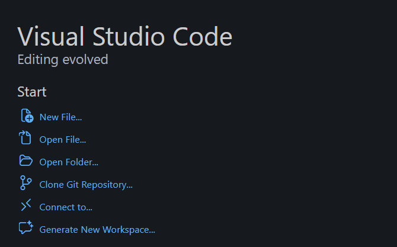
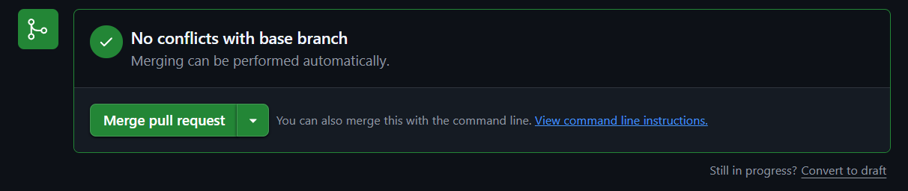

# Primeiro fluxo com Git e GitHub

Essa seção é um tutorial simples do ciclo básico de trabalho: criar um repositório, trazer esse repositório para sua máquina, fazer mudanças e enviá-las de volta para a nuvem.

Use-a para consulta sempre que necessário!

## Criando um repositório

Vamos criar um repositório, que é onde o projeto ficará armazenado.

1. No GitHub, clique no botão `+` no canto superior direito.
2. Clique em `New repository`.


3. Preencha:

- nome do projeto;
- visibilidade: público ou privado;
- `README`: pode deixar marcado;
- `.gitignore`: escolha `Python`.

4. Clique em `Create repository`.

## Clonando um repositório

Clonar significa trazer uma cópia do repositório do GitHub para a sua máquina.

1. No repositório, clique no botão verde `Code`.
2. Escolha a aba correta:

- **Windows**: `HTTPS`
- **macOS e Linux**: `SSH`

3. Copie a URL mostrada.


Ela terá um formato parecido com um destes:

```text
Windows (HTTPS):
https://github.com/usuario/nome-do-repositorio.git

macOS/Linux (SSH):
git@github.com:usuario/nome-do-repositorio.git
```

4. Abra o Visual Studio Code em uma janela nova.



5. Clique em `Clone Git Repository...`
6. Cole a URL copiada e aperte `Enter`.

Se você estiver no Windows, pode aparecer uma janela do navegador pedindo para fazer login no GitHub. Isso faz parte da autenticação por HTTPS.

Pronto: agora o repositório existe na nuvem e também na sua máquina.

## Criando uma branch

Branch é uma linha paralela de trabalho. Em vez de alterar direto a `main`, você cria uma branch para desenvolver uma tarefa específica.

Isso reduz o risco de quebrar a versão principal do projeto e facilita a revisão.

No terminal do VS Code, rode:

```bash
git switch -c nome-da-branch
```

Exemplo:

```bash
git switch -c adiciona-grafico-inicial
```

Para ver em qual branch você está:

```bash
git branch
```

## Salvando suas mudanças com commit

Depois de editar os arquivos, o primeiro passo é verificar o que mudou:

```bash
git status
```

Depois, adicione os arquivos ao próximo commit:

```bash
git add .
```

Agora crie um commit, que é um registro das mudanças que você fez:

```bash
git commit -m "Adiciona grafico inicial do projeto"
```

## Enviando sua branch para o GitHub

Depois de criar commits na sua máquina, você precisa publicar essa branch no GitHub:

```bash
git push -u origin nome-da-branch
```

Na primeira vez, troque `nome-da-branch` pelo nome real da branch que você criou.

## Abrindo um Pull Request (PR)

Um Pull Request é o pedido para que suas mudanças entrem no projeto principal.

Na prática, ele serve para:

- mostrar o que você alterou;
- permitir revisão por outras pessoas;
- discutir mudanças antes do merge;
- manter a `main` mais estável.

Depois de fazer `git push`, o GitHub normalmente mostra o botão `Compare & pull request`.


1. Clique nesse botão.
2. Revise o título e a descrição do PR.
3. Clique em `Create pull request`.

## Revisando e fazendo merge do PR

1. Veja as alterações na aba `Files changed`.
2. Se estiver tudo certo, o merge pode ser feito na aba `Conversation`.


3. Clique em `Merge pull request`.



Se houver conflitos, será necessário resolvê-los antes do merge. Quando isso acontecer, peça ajuda sem hesitar: conflito de branch é uma parte normal do trabalho com Git.

## Atualizando sua cópia local com `git pull`

Antes de começar uma tarefa nova, atualize sua `main`.

Primeiro, volte para a branch principal:

```bash
git switch main
```

Depois, puxe as alterações mais recentes do GitHub:

```bash
git pull origin main
```
