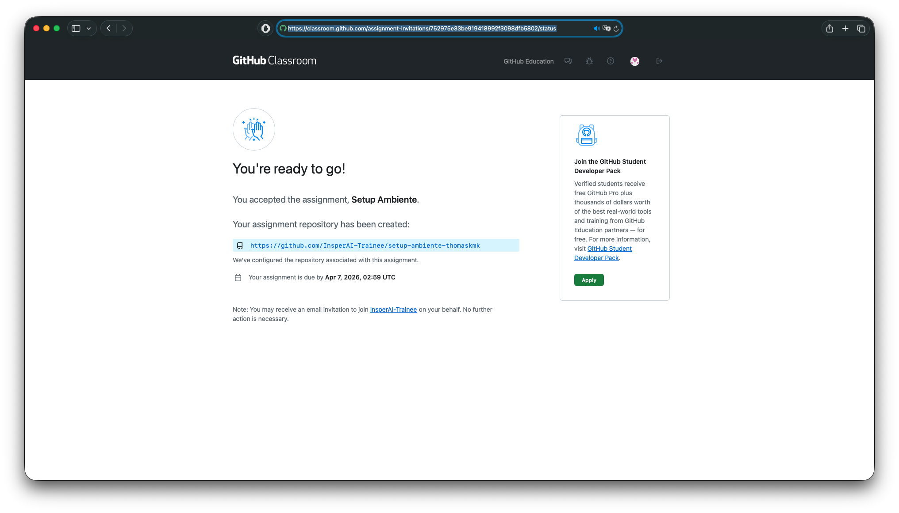
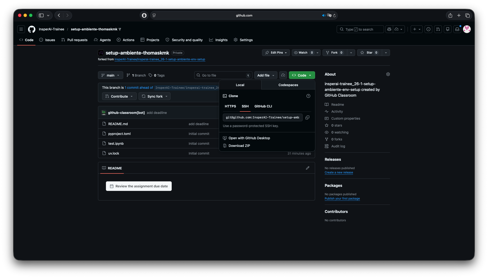

# GitHub

O GitHub é a plataforma onde vamos hospedar nossos projetos na nuvem.

Na prática, ele permite:

- guardar seus projetos online;
- compartilhar código com outras pessoas;
- colaborar em grupo;
- sincronizar o projeto entre sua máquina e a nuvem.

## O que é um repositório?

Um repositório é a pasta do projeto organizada para ser acompanhada pelo Git.

Na prática, é onde ficam:

- os arquivos do seu código;
- o histórico das alterações;
- as branches do projeto;
- as informações necessárias para colaborar com outras pessoas.

Você pode pensar em um repositório como a "casa" do projeto.

Quando o repositório está no seu computador, você trabalha localmente. Quando ele está no GitHub, ele também passa a existir na nuvem, o que permite salvar, compartilhar e sincronizar o projeto com outras pessoas.

## Crie sua conta

1. Acesse: [github.com](https://github.com)
2. Crie sua conta.
3. Confirme o email usado no cadastro.

Se você ainda não configurou seu nome e email no Git, volte um momento para a etapa anterior e rode os comandos de `git config`.

## Conectando sua máquina ao GitHub

Para de fato sincronizar o código que você escreve no seu computador com o código que está na nuvem, você precisa de autenticação e aqui entra uma distinção importante:

- sua senha do GitHub serve para entrar no site;
- no terminal, a autenticação pode ser feita por SSH ou por HTTPS, dependendo do sistema operacional.

Neste handout, vamos seguir assim:

- **Windows**: usar **HTTPS**
- **macOS e Linux**: usar **SSH**

### **Windows: conectando por HTTPS**

No Windows, vamos usar HTTPS porque esse caminho costuma ser mais simples para quem está começando.

Se você instalou o Git for Windows na etapa anterior, o Git Credential Manager já deve vir junto com ele. Na prática, isso significa que, na primeira vez em que você clonar ou enviar código para o GitHub usando uma URL `https://`, o sistema deve abrir uma janela do navegador para você fazer login.

Você não precisa configurar chave SSH no Windows para seguir este handout. Vá para a etapa de **Atividade**.

### **macOS e Linux: conectando por SSH**

No macOS e no Linux, vamos usar SSH. Esse é um método estável e comum para trabalhar com GitHub no terminal.

#### 1. Gere uma chave SSH

No terminal, rode: **(Não esqueça de mudar o e-mail para o mesmo da conta do GitHub)**

```bash
ssh-keygen -t ed25519 -C "seu-email@exemplo.com"
```

Use o mesmo email da sua conta do GitHub.

Quando aparecerem as perguntas:

1. Aperte `Enter` para aceitar o local padrão do arquivo.
2. Aperte `Enter` duas vezes para criar a chave sem passphrase (É uma camada de proteção extra que não vai ser necessária)

#### 2. Adicione a chave ao `ssh-agent`

```bash
eval "$(ssh-agent -s)"
ssh-add ~/.ssh/id_ed25519
```

#### 3. Copie sua chave pública

```bash
cat ~/.ssh/id_ed25519.pub
```

Copie a linha inteira exibida no terminal.

#### 4. Cadastre a chave no GitHub

1. No GitHub, clique na sua foto de perfil.
2. Entre em `Settings`.
3. Vá em `SSH and GPG keys`.
4. Clique em `New SSH key`.
5. Dê um nome para a chave, como `Notebook pessoal` ou `PC de casa`.
6. Cole a chave pública copiada no passo anterior.
7. Salve.

#### 5. Teste a conexão

Rode:

```bash
ssh -T git@github.com
```

Na primeira vez, o terminal pode perguntar se você quer confiar no servidor do GitHub. Digite `yes`.

Se tudo deu certo, você verá uma mensagem dizendo que a autenticação funcionou.

## Atividade

Ao longo do programa, várias aulas terão handouts a serem realizados em um repositório de código. Para criar esses repositórios, usaremos o GitHub Classroom, uma ferramenta do GitHub que centraliza repositórios para organização de cursos como esse.

Para testar se tudo foi configurado corretamente, vamos praticar com uma atividade simples:

### Aceitando o assignment

- Abra o [link do classroom](https://classroom.github.com/a/B-dto_MZ) e clique em "Accept this assignment". Uma tela com a seguinte deve ser aberta:



O GitHub Classroom automaticamente cria um repositório para você, a partir de um template com os arquivos de cada atividade.

- Clique no link do repositório. A página do seu repositório no GitHub deve abrir:



### Clonando o repositório

Até agora o repositório só existe na nuvem. Para de fato trabalhar nele, você precisa  clonar o repositório, ou seja, ter uma cópia local dele no seu computador. Para isso:

- Clique no botão verde `Code`.
- Escolha a aba correta:

    - **Windows**: `HTTPS`
    - **macOS e Linux**: `SSH`

- Copie a URL do repositório.

Ela terá um formato parecido com um destes:

```text
Windows (HTTPS):
https://github.com/usuario/nome-do-repositorio.git

macOS/Linux (SSH):
git@github.com:usuario/nome-do-repositorio.git
```

- Abra o terminal na pasta em que você quer salvar o repositório.

Exemplo:
```bash
cd Documents/insper-ai/trainee
```

!!! note "Atenção"
    Mantenha uma boa organização dos repositórios, teremos vários durante o Trainee

- Rode o comando abaixo, trocando a URL pelo endereço que você copiou:

```bash
git clone URL_DO_REPOSITORIO
```

Exemplo no Windows:

```bash
git clone https://github.com/usuario/nome-do-repositorio.git
```

Exemplo no macOS/Linux:

```bash
git clone git@github.com:usuario/nome-do-repositorio.git
```

- Se você estiver no Windows, pode aparecer uma janela do navegador pedindo login no GitHub. Isso faz parte da autenticação por HTTPS.
- Quando o comando terminar, entre na pasta do repositório:

```bash
cd nome-do-repositorio
```

Se tudo deu certo, você terá uma pasta no seu computador com o nome do repositório que você viu no GitHub. Dentro dela, você criará e gerenciará seus códigos. 

Para fazer isso, você vai precisar de um **editor de código (IDE)**. Te ensinaremos na próxima seção.
