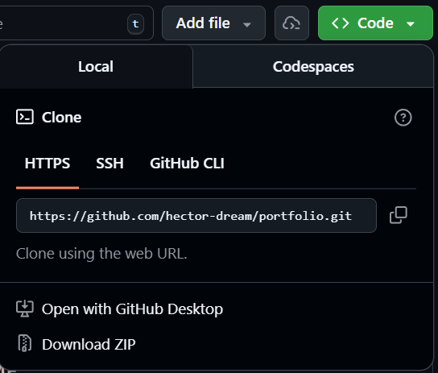
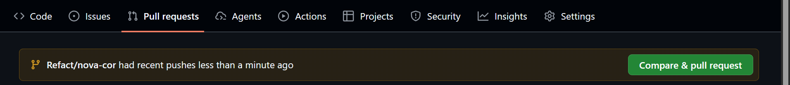
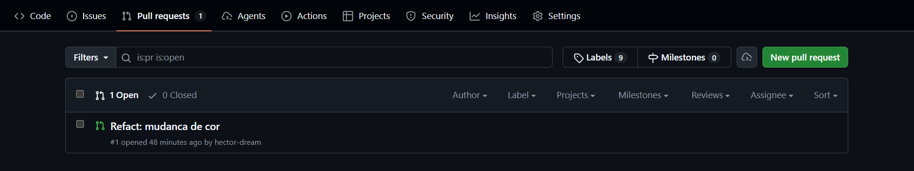

# GitHub

É uma plataforma online que nos permite:

- armazenar projetos com Git;
- compartilhar código e colaborar com outras pessoas;
- manter versões do seu projeto na nuvem.

## Crie uma conta

Acesse: [GitHub](https://github.com)

## Criando um Repositório:

Vamos criar um repositório (onde ficará armazenado nosso projeto) clicando no "+":


1. Clique em "New repository"
2. Aqui, você pode:
- escolher o nome do projeto; 
- definir se ele é público ou privado; 
- incluir um arquivo README no projeto (recomendo sempre deixar on para poder documentar os projetos);
- adicionar python para o .gitignore (arquivo importante para guardar segredos do projeto que não podem vir a público).
3. "Clique em "Create repository"

## Clonando um repositório:

1. Clicando no botão verde "Code", você verá algo como:



2. Copie essa URL que aparece.
3. Abra o Visual Studio Code em uma janela nova, e verá:


4. Clique em "Clone Git Repository..." e cole a URL que você copiou. Aperte Enter.

Pronto, o repositório criado por você ou terceiros agora está na sua maquina sujeito às suas mudanças.

Normalmente, nossos projetos serão feitos em grupo, havendo o risco de que a mesma linha de código seja sobrescrita por mais de um programador, o que pode resultar em conflitos tenebrosos os quais você certamente não quer resolver. Para contornar esses problemas ao trabalhar em equipe, seguimos uma série de boas práticas, que a princípio podem parecer redundantes, mas fazem toda a diferença no dia a dia.

Primeiro, vamos falar de branches.

## Branches

São as cópias do projeto principal (main) que você faz na sua máquina. Parece redundante, mas existe um grande risco em codar direto na main: se você quebrar o código e enviar para o GitHub, você quebra o projeto - e nem sempre é simples voltar atrás. Por isso existeme as branches, são cópias perfeitas que podem ser descartadas, sem afetar todo o projeto.

Normalmente, uma branch serve para fazer uma tarefa espefícica, então não tenha medo de criar muitas branches - elas são seus checkpoints.

1. Para criar uma branch, basta abrir o próprio terminal do VS Code e rodar:

````
git branch "nome-da-branch"
````
Você pode visualizar todas as branches criadas deixando o campo do nome vazio

2. Entrando na branch:

````
git switch nome-da-branch
````

3. Faça suas alterações e salve com um commit (são os checkpoints dos seus checkpoints):

````
git add . (inclue todas suas alterações para mandar para o GitHUb. Sim, o "." faz parte do comando)

git status (não é obrigatório, mas sempre verifique o status para saber se todas suas alterações sofram incluidas)

git commit -m "Nome do commit: [shift+enter]
descrição das alterações que você fez"

git push origin main (faça isso só quando você quiser publicar a branch, você pode fazer vários commits antes de rodar esse comando)

````
obs: copie uma linha de cada vez nessa sequência, sem incluir os comentários entre parênteses.

4. Feito isso, você vai abrir um PR no GitHub.


## Pull Request (PR)

Você deve fazer um PR para enviar suas mudanças em um projeto para o GitHub (onde está o projeto principal).
Um PR é você pedindo para o resto do seu grupo analisar as alterações que você fez e decidir se elas podem ser incluídas .

1. Clique em "Compare & pull request":



Depois dessa tela, crie seu PR apertando em create.

2. Você não deve aprovar seu projeto por conta própria, mesmo que ele não tenha nenhum conflito, mas você pode aprovar o de outras pessoas:



3. Verifique as mudanças feitas na aba "Files Changed". Se tudo parecer de acordo, aceite o PR na aba de "Conversation" apertando em "Merge pull request":


4. Se houver conflitos, você terá que resolver antes de dar o merge. Sempre que necessário, consulte alguém para te auxiliar, sabemos que não é trivial, então não tenha receio de perguntar.

## Git Pull

Esse comando serve para você puxar todas as alterações que estão no GitHub para a sua máquina. 

1. É necessário que você esteja na main para executar esse comando. Para isso, rode:


````
git checkout main

````

2. Escreva no terminal:

````

git pull

````