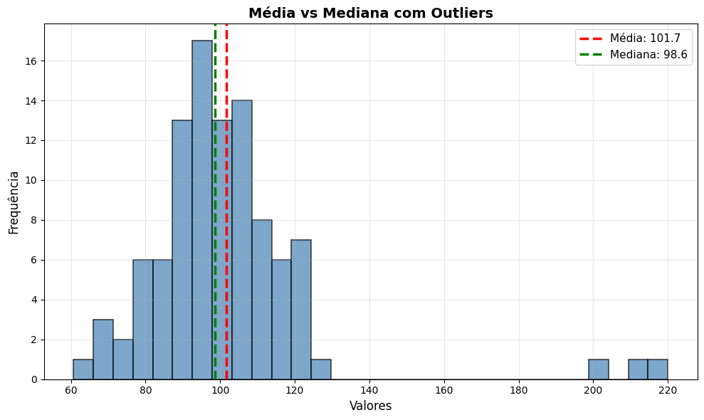
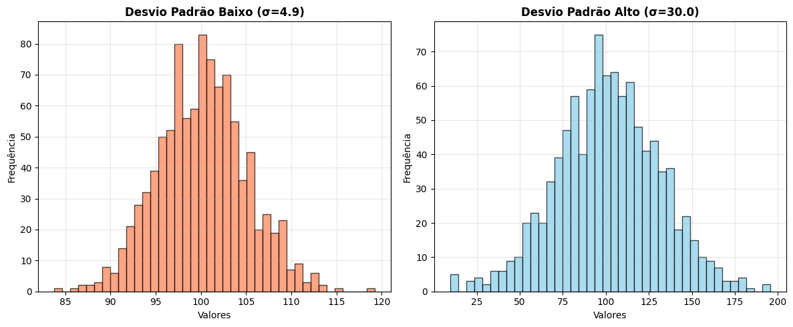
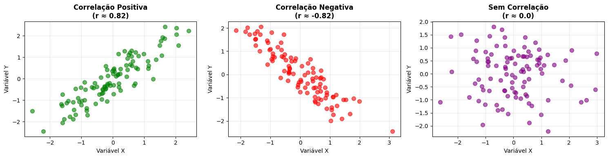
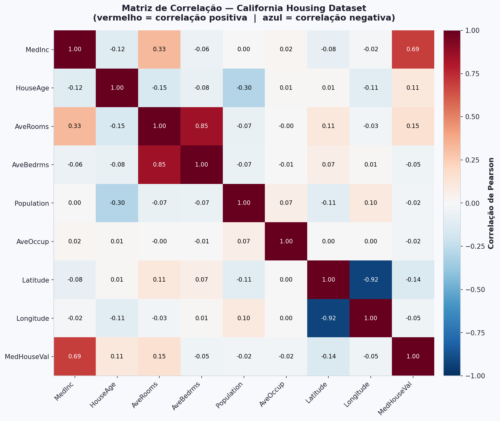
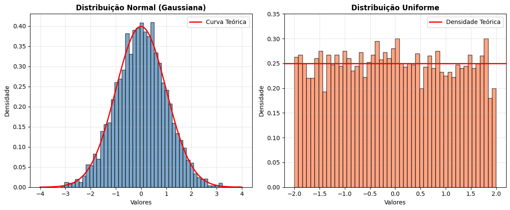

# 📊 Estatística e Probabilidade

Modelos de Machine Learning são, na essência, ferramentas estatísticas. Antes de treinar qualquer modelo, precisamos entender como descrever e interpretar os dados que ele vai aprender. Esta seção cobre os conceitos que vão aparecer em toda análise exploratória.

---

## Medidas de Tendência Central

Quando temos um conjunto de dados, a primeira pergunta é: **qual é o valor típico?**

- **Média** — soma de todos os valores dividida pela quantidade. Sensível a outliers.
- **Mediana** — valor central quando os dados estão ordenados. Robusta a outliers.
- **Moda** — valor que aparece com mais frequência. Útil para dados categóricos.

:::warning[Média vs. Mediana]

Repare no gráfico: três outliers extremos puxaram a média para longe do centro real dos dados, enquanto a mediana permaneceu estável. Em distribuições assimétricas ou com outliers, a mediana representa melhor o valor típico.

:::

---

## Variância e Desvio Padrão

Saber o valor típico não é suficiente — precisamos saber o quanto os dados **se afastam** desse valor.

- **Variância** — média dos quadrados dos desvios em relação à média.
- **Desvio padrão (σ)** — raiz quadrada da variância. Na mesma unidade dos dados, mais fácil de interpretar.

Um desvio padrão baixo significa que os dados estão concentrados perto da média. Um desvio padrão alto significa que estão espalhados.

:::note[Desvio padrão em ML]

O desvio padrão é usado na normalização dos dados — uma etapa essencial antes de treinar modelos. Features com escalas muito diferentes podem fazer o modelo aprender de forma distorcida.

:::

---

## Correlação

Correlação mede o quanto duas variáveis **variam juntas** — e em qual direção.

- **Correlação positiva** — quando uma sobe, a outra também sobe.
- **Correlação negativa** — quando uma sobe, a outra desce.
- **Sem correlação** — as variações de uma não dizem nada sobre a outra.

O coeficiente de correlação vai de **-1** (correlação negativa perfeita) a **+1** (correlação positiva perfeita). Zero indica ausência de relação linear.

:::warning[Correlação não é causalidade]

Duas variáveis podem ser correlacionadas sem que uma cause a outra. Sorvete vendido e afogamentos são correlacionados — ambos aumentam no verão. Isso não significa que sorvete causa afogamentos.

:::

---

## Heatmap de Correlação

Quando temos muitas variáveis, calcular a correlação par a par manualmente é inviável. O heatmap de correlação resolve isso: cada célula mostra o coeficiente entre duas variáveis, com cores indicando a direção e intensidade.

Perceba que há uma simetria nesse heatmap. Por que você acha que ele tem essa característica?

:::tip[O que procurar em um heatmap]

- Células vermelhas intensas → forte correlação positiva com o target
- Células azuis intensas → forte correlação negativa
- Correlações altas **entre features** (não com o target) podem indicar redundância — duas colunas dizendo a mesma coisa ao modelo

:::

:::warning[Spoiler!]

 Esse heatmap representa o dataset Californian Houses, que usaremos na próxima aula ( Regressão Linear ), por enquanto, interprete as features com base no nome e com base na correlação de cada uma.

:::

---

## Distribuições de Probabilidade

Uma distribuição descreve como os valores de uma variável estão espalhados. As duas mais comuns em ML são:

**Normal (gaussiana)** — simétrica, concentrada na média, com caudas que decaem rapidamente. A maioria dos fenômenos naturais segue aproximadamente essa distribuição.

**Uniforme** — todos os valores no intervalo têm a mesma probabilidade. Usada frequentemente para gerar dados aleatórios e inicializar parâmetros de modelos.

:::note[Por que isso importa?]

Vários algoritmos assumem que os dados seguem uma distribuição normal. Quando isso não acontece — como em variáveis com muitos outliers ou distribuições assimétricas — pode ser necessário transformar os dados antes de treinar o modelo.

:::

---

## 📚 Explore a Documentação

- **NumPy estatísticas:** [numpy.org/doc/stable/reference/routines.statistics](https://numpy.org/doc/stable/reference/routines.statistics.html)
- **Seaborn (visualizações):** [seaborn.pydata.org](https://seaborn.pydata.org)
- **Matplotlib:** [matplotlib.org/stable/gallery](https://matplotlib.org/stable/gallery/index.html)
