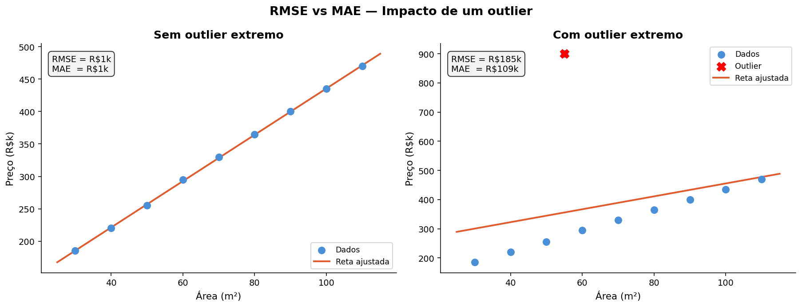
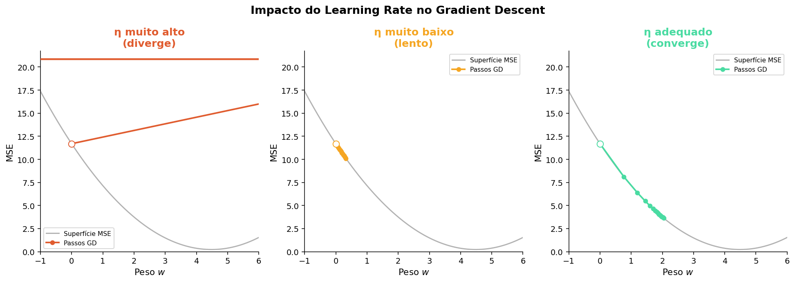
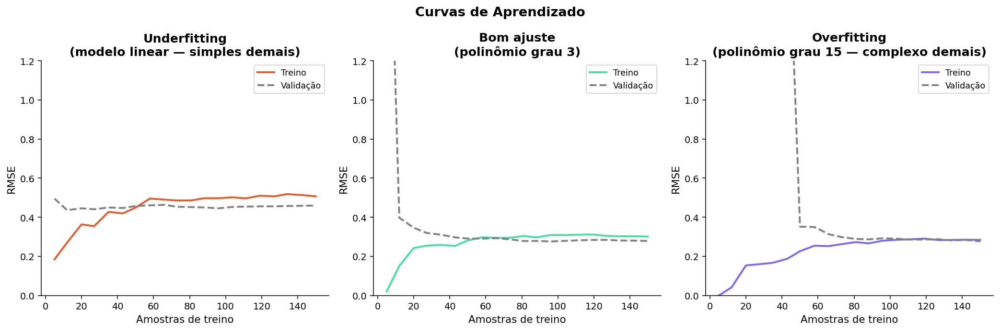

# 📈 Regressão Linear — Teoria

Regressão linear é o ponto de entrada para machine learning supervisionado. É simples o suficiente para entender completamente, e rico o suficiente para revelar como todos os outros modelos funcionam por baixo dos panos.

---

## A ideia central

Você tem dados de 40 imóveis vendidos: área e preço de cada um. Jogando isso num gráfico, um padrão aparece: imóveis maiores tendem a custar mais.

Regressão linear encontra e representa esse padrão como uma **reta**. Essa reta é o modelo, quando chegar um imóvel novo, ele olha para a reta e estima o preço.

A pergunta que guia tudo daqui para frente é: **entre todas as retas possíveis, qual é a melhor?**

---

## A equação da reta

$$\hat{y} = mx + b$$

| Símbolo | Nome | No exemplo |
|---|---|---|
| $x$ | variável de entrada | área do imóvel (m²) |
| $\hat{y}$ | valor previsto | preço estimado (R\$) |
| $m$ | inclinação | quanto o preço sobe a cada m² a mais |
| $b$ | intercepto | valor base quando a área tende a zero |

O modelo aprende **dois números**: $m$ e $b$. O treino é o processo de descobrir quais valores fazem a reta representar melhor os dados.

:::note[Outras notações]

A mesma equação aparece como $\hat{y} = \theta_1 x + \theta_0$ ou $\hat{y} = w_1 x + w_0$. Os símbolos mudam, o conceito é idêntico.

:::

---

## Resíduos — medindo o erro de cada ponto

Para cada imóvel, o modelo faz uma previsão. A diferença entre o valor real e o previsto é o **resíduo**:

$$r_i = y_i - \hat{y}_i$$

Um resíduo positivo significa que o modelo subestimou o preço. Negativo, que superestimou. O objetivo do treino é encontrar a reta que minimize esses erros **no conjunto todo**, não apenas em alguns pontos.

---

## Função de Custo — MSE

Precisamos de um número único que resuma todos os resíduos ao mesmo tempo. É para isso que serve a **função de custo**. A mais usada em regressão linear é o **MSE** (Mean Squared Error):

$$MSE = \frac{1}{n} \sum_{i=1}^{n} (y_i - \hat{y}_i)^2$$

**Por que elevar ao quadrado?** Dois motivos: erros positivos e negativos não se cancelam, e erros maiores são penalizados de forma mais intensa, um erro de 100k pesa 4× mais que um de 50k.

O modelo então testa diferentes valores de $m$ e $b$, calcula o MSE para cada combinação e **caminha na direção que o reduz**, repetindo até convergir. Esse processo é o **Gradient Descent**:

:::tip[O que observar]

Nas primeiras iterações a reta erra muito. A cada passo ela se ajusta, as linhas vermelhas (resíduos) vão diminuindo até a reta encontrar o melhor equilíbrio.

:::

---

## Equação Normal — a solução direta

Para a regressão linear existe um atalho: em vez de iterar, podemos resolver a equação diretamente com álgebra linear:

$$\hat{\mathbf{w}} = (X^T X)^{-1} X^T \mathbf{y}$$

O `LinearRegression` do scikit-learn usa exatamente essa fórmula por baixo dos panos, é por isso que ele treina em uma única chamada `.fit()`, sem hiperparâmetros de iteração.

:::warning[Quando a Equação Normal falha]

Se $X^TX$ não for invertível, por features redundantes ou mais features do que amostras, a solução fechada quebra. Nesses casos usamos Gradient Descent.

:::

---

## De uma feature para muitas — notação vetorial

Até aqui usamos só a área para prever o preço. Mas datasets reais têm dezenas de features. A equação se generaliza naturalmente:

$$\hat{y} = w_1 x_1 + w_2 x_2 + \cdots + w_n x_n + b$$

Isso é exatamente um **produto escalar** entre o vetor de pesos $\mathbf{w}$ e o vetor de features $\mathbf{x}$:

$$\hat{y} = \mathbf{w}^T \mathbf{x} + b$$

Quando temos múltiplas amostras ao mesmo tempo, empilhamos as features numa **matriz** $X$, e a previsão para todo o dataset vira uma única operação matricial:

$$\hat{\mathbf{y}} = X\mathbf{w} + b$$

Com duas features, a reta vira um **plano** no espaço tridimensional:

:::note[Por que matrizes importam?]

Toda a matemática de ML supervisionado (regressão, redes neurais, SVM) se reduz a operações matriciais. Entender que uma previsão é um produto escalar é a base para entender qualquer modelo mais complexo.

:::

---

## Avaliando o modelo — R², RMSE e MAE

Após treinar, precisamos medir a qualidade do modelo. Três métricas são essenciais:

**R² — Coeficiente de Determinação**

$$R^2 = 1 - \frac{\sum(y_i - \hat{y}_i)^2}{\sum(y_i - \bar{y})^2}$$

Vai de 0 a 1: quanto maior, mais variação nos dados o modelo consegue explicar. Um R² de 0.85 significa que 85% da variação nos preços é capturada pelo modelo.

**RMSE e MAE** medem o erro médio na unidade original do problema, mas reagem de forma diferente a outliers:

$$MAE = \frac{1}{n}\sum|y_i - \hat{y}_i| \qquad RMSE = \sqrt{\frac{1}{n}\sum(y_i - \hat{y}_i)^2}$$

| | MAE | RMSE |
|---|---|---|
| **Sensibilidade a outliers** | Baixa | Alta |
| **Quando usar** | Outliers não devem dominar a métrica | Erros grandes são especialmente indesejados |

:::tip[Regra prática]

Se um erro de R\$ 200k é exatamente o dobro do problema de um erro de R\$ 100k → **MAE**.
Se um erro de R\$ 200k é muito pior do que dois erros de R\$ 100k → **RMSE**.

:::

:::warning[R² alto no treino não garante um bom modelo]

Um modelo pode memorizar os dados de treino e falhar em dados novos, isso se chama *overfitting*. Sempre avalie em dados que o modelo nunca viu.

:::

---

## Learning Rate — a velocidade do aprendizado

Quando usamos Gradient Descent, o tamanho de cada passo é controlado pelo **learning rate** ($\eta$). Escolhê-lo bem é fundamental:

| Learning rate | O que acontece |
|---|---|
| **Muito alto** | Os passos ultrapassam o mínimo, o modelo oscila ou diverge |
| **Muito baixo** | Converge, mas lentamente, pode exigir milhares de iterações |
| **Adequado** | Converge de forma estável em poucas iterações |

:::warning[O `LinearRegression` do sklearn não usa learning rate]

Ele resolve a Equação Normal, sem iterações. O learning rate entra em cena com o `SGDRegressor` e, mais à frente, com redes neurais. Vale conhecer agora porque vai aparecer em toda aula daqui para frente.

:::

---

## Curvas de Aprendizado — diagnosticando o modelo

Uma curva de aprendizado plota o erro em função do tamanho do conjunto de treino, separando treino e validação. É a forma mais direta de identificar se o modelo está com underfitting ou overfitting:

:::note[Underfitting — modelo simples demais]

As duas curvas convergem para um erro **alto**. Adicionar mais dados não resolve, o modelo não tem capacidade suficiente para capturar os padrões.

:::

:::tip[Bom ajuste]

As curvas convergem para um erro **baixo**. O modelo aprendeu os padrões sem memorizar os dados.

:::

:::danger[Overfitting — modelo complexo demais]

O erro de treino é **baixo**, mas o de validação é **alto** e as curvas não convergem. O modelo memorizou o treino e não generalizou para dados novos.

:::

---

## 📚 Explore a Documentação

- **Scikit-learn — LinearRegression:** [sklearn.linear_model.LinearRegression](https://scikit-learn.org/stable/modules/generated/sklearn.linear_model.LinearRegression.html)
- **Scikit-learn — métricas de regressão:** [model_evaluation](https://scikit-learn.org/stable/modules/model_evaluation.html#regression-metrics)
- **StatQuest — Linear Regression (vídeo):** [youtube.com/watch?v=nk2CQITm_eo](https://www.youtube.com/watch?v=nk2CQITm_eo)
